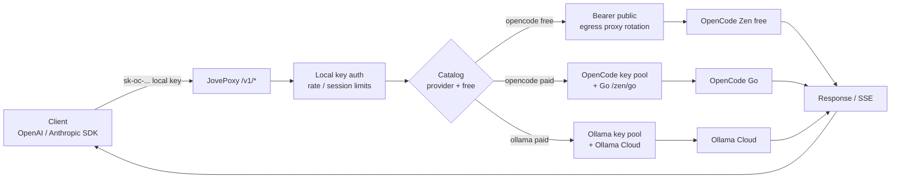
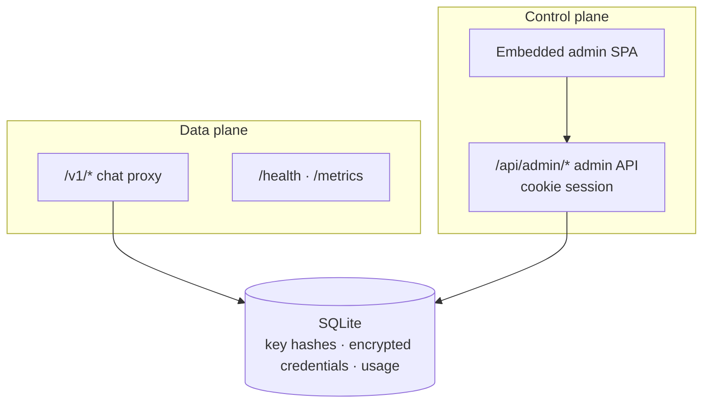

<p align="center">
  
</p>

<h1 align="center">JovePoxy</h1>

<p align="center">
  Single-process gateway: unify <strong>OpenCode Zen</strong> free models + paid key pool and <strong>Ollama Cloud</strong> key pool into OpenAI / Anthropic compatible APIs, with an embedded Neo-Brutalist admin console
</p>

<p align="center">
  <a href="https://github.com/jiujiu532/JovePoxy"></a>
  <a href="https://github.com/jiujiu532/JovePoxy/releases"></a>
  <a href="https://github.com/jiujiu532/JovePoxy/pkgs/container/jovepoxy"></a>
  <a href="https://go.dev/"></a>
  <a href="https://react.dev/"></a>
  
</p>

<p align="center">
  <a href="README.md">简体中文</a> ·
  <a href="README.en.md">English</a> ·
  <a href="https://github.com/jiujiu532/JovePoxy/releases">Releases</a> ·
  <a href="#quick-start">Quick Start</a> ·
  <a href="#configuration">Configuration</a>
</p>

---

## What it is

JovePoxy (`module jovepoxy`) is a **single binary** gateway:

| Surface | Role |
|---------|------|
| Data plane | `POST /v1/chat/completions`, `/v1/responses`, `/v1/messages` (SSE supported) |
| Model catalog | **Zen free** (public) + **OpenCode Go** (healthy OpenCode pool key) + **Ollama Cloud** (healthy Ollama pool key) |
| Upstream | Free → Zen `Bearer public`; paid OpenCode → **Go** `/zen/go` + key pool; paid Ollama → Ollama Cloud + key pool |
| Control plane | `/api/admin/*` cookie session + embedded SPA on the same listener |
| Storage | Single SQLite file; **no** local OpenCode or local Ollama runtime required |

Version: `internal/version.Current` (default **1.0.0**); `--version` and `/health` report `jovepoxy 1.0.0`.

## Features

- **Triple endpoints**: OpenAI Chat Completions, OpenAI Responses, and Anthropic Messages behind one local API key.
- **Plan-scoped catalog**: public Zen keeps free only; merge **Go** `/zen/go/v1/models` when a healthy `provider=opencode` key exists; merge Ollama Cloud `/v1/models` when a healthy `provider=ollama` key exists. Public Claude/Gemini (etc.) not on Go are not advertised.
- **Provider-aware routing**: OpenCode free → `/zen/v1` + `Bearer public`; OpenCode paid → `/zen/go/v1` + key pool; Ollama paid → Ollama Cloud + key pool (plain Bearer, no OpenCode compatibility headers).
- **Local keys `sk-oc-...`**: clients only talk to the gateway; optional RPM / daily limits and concurrent sessions; only SHA-256 is stored.
- **Key pool + egress proxy pool**: key = identity, proxy = egress IP; free path can rotate proxies on 429/5xx; paid supports spread / sticky and failover.
- **Quota & usage**: OpenCode / Ollama **account cookies are control-plane only** and never enter the chat path.
- **Neo-Brutalist admin UI**: overview, model catalog (provider filter), key pool, accounts, quotas, local keys, proxies, logs, settings; dark mode.
- **Safe defaults**: pool keys, cookies, and proxy URLs encrypted with `ADMIN_SECRET` (AES-GCM); request logs omit prompt/response bodies.

## Request flow

<details>
<summary><strong>Chat routing</strong></summary>



</details>

<details>
<summary><strong>Control vs data plane</strong></summary>



</details>

## Quick Start

### Docker (recommended)

```bash
docker run -d --name jovepoxy \
  -p 6446:6446 \
  -e ADMIN_PASSWORD=your-password \
  -e ADMIN_SECRET=please-use-a-32-plus-char-secret \
  -v jovepoxy-data:/data \
  ghcr.io/jiujiu532/jovepoxy:1.0.0
# or :latest
```

Open `http://127.0.0.1:6446/`, sign in with `ADMIN_PASSWORD` → create a local key → add OpenCode and/or Ollama API keys in the key pool as needed.

### docker-compose

```yaml
services:
  jovepoxy:
    image: ghcr.io/jiujiu532/jovepoxy:1.0.0
    ports:
      - "6446:6446"
    environment:
      ADMIN_PASSWORD: your-password
      ADMIN_SECRET: please-use-a-32-plus-char-secret
      DATA_DIR: /data
      LISTEN: 0.0.0.0:6446
    volumes:
      - jovepoxy-data:/data
volumes:
  jovepoxy-data:
```

### Build from source

```bash
# frontend
cd web && pnpm install --frozen-lockfile && pnpm build && cd ..

# embed and compile (Windows: make embed-web-win)
mkdir -p internal/webui/dist && cp -R web/dist/. internal/webui/dist/
go build -ldflags "-X jovepoxy/internal/version.Current=1.0.0" -o bin/jovepoxy ./cmd/server

# run (ADMIN_SECRET ≥ 32 chars)
export ADMIN_PASSWORD=...
export ADMIN_SECRET=...
export DATA_DIR=./data
export LISTEN=127.0.0.1:6446
./bin/jovepoxy
```

On Windows you can also use `start.bat` / `stop.bat` (default listen `127.0.0.1:6446`).

## Client examples

```bash
# OpenAI Chat Completions
curl http://127.0.0.1:6446/v1/chat/completions \
  -H "Authorization: Bearer sk-oc-..." \
  -H "Content-Type: application/json" \
  -d '{"model":"big-pickle","messages":[{"role":"user","content":"hello"}]}'

# OpenAI Responses
curl http://127.0.0.1:6446/v1/responses \
  -H "Authorization: Bearer sk-oc-..." \
  -H "Content-Type: application/json" \
  -d '{"model":"big-pickle","input":"hello"}'

# Anthropic Messages
curl http://127.0.0.1:6446/v1/messages \
  -H "x-api-key: sk-oc-..." \
  -H "anthropic-version: 2023-06-01" \
  -H "Content-Type: application/json" \
  -d '{"model":"claude-sonnet-4-5","max_tokens":256,"messages":[{"role":"user","content":"hello"}]}'
```

Public `GET /v1/models`: free only by default; `SHOW_ALL_MODELS=true` includes paid entries from the plan catalog (Go + Ollama, not unusable public paid IDs). `owned_by` is `zen` (OpenCode) or `ollama`.

## Configuration

| Env var | Required | Default | Description |
|---------|----------|---------|-------------|
| `ADMIN_PASSWORD` | yes | - | Admin console password |
| `ADMIN_SECRET` | yes | - | 32+ chars; encrypts pool keys / cookies / proxy URLs |
| `LISTEN` | no | `0.0.0.0:6446` | Listen address; use `127.0.0.1:6446` for local-only |
| `DATA_DIR` | no | `./data` | SQLite directory (`/data` in containers) |
| `ZEN_BASE` | no | `https://opencode.ai/zen/v1` | OpenCode Zen **free** upstream (`Bearer public`) |
| `ZEN_GO_BASE` | no | `https://opencode.ai/zen/go` | OpenCode **Go** suite catalog + paid chat (appends `/v1` when needed) |
| `OLLAMA_BASE` | no | `https://ollama.com` | Ollama Cloud root; normalized to `…/v1` at runtime |
| `MODEL_CACHE_TTL` | no | `5m` | Model catalog cache TTL |
| `UPSTREAM_TIMEOUT` | no | `120s` | Upstream timeout |
| `SHOW_ALL_MODELS` | no | `false` | When `true`, `/v1/models` lists all models |
| `COOKIE_SECURE` | no | `false` | Secure flag on admin cookie; prefer `true` behind HTTPS |
| `VERSION_REPO` | no | `jiujiu532/JovePoxy` | GitHub repo for admin release checks |
| `HTTP_PROXY` / `HTTPS_PROXY` | no | - | Process-level upstream proxy (distinct from the admin egress pool) |
| `ZEN_LOAD_POLICY` | no | `spread` | Paid pool policy: `spread` \| `sticky` (also mutable in settings) |
| `ZEN_MAX_ATTEMPTS` | no | `2` | Paid failover attempts (2–4) |

## Credential model (do not mix)

| Credential | Purpose | Chat path |
|------------|---------|:---------:|
| Local key `sk-oc-...` | Client → gateway | yes |
| `Bearer public` | Zen free outbound | yes |
| Pool key `provider=opencode` | Zen paid outbound | yes |
| Pool key `provider=ollama` | Ollama Cloud outbound + catalog fetch | yes |
| OpenCode / Ollama **account cookies** | Quota / usage scrape | **no** |
| `ADMIN_PASSWORD` | Admin login | no |

> **Note**: An Ollama **account + cookie** in the admin UI does **not** populate the model catalog or serve chat. To list Ollama models on the Models page, add an enabled Ollama **API key** to the **key pool**.

## Tech stack

Go 1.25 · SQLite (modernc, CGO-free) · React 19 · Vite 7 · Tailwind CSS 4 · Phosphor Icons · Vitest · pnpm

## Development

```bash
make test              # go test -shuffle=on -count=1 ./...
make vet
make build             # go build -o bin/jovepoxy(.exe) ./cmd/server
make embed-web-win     # build web into internal/webui/dist (Windows)
make smoke             # local health / login / key create (no live Zen)

cd web
pnpm install --frozen-lockfile
pnpm dev               # :5173, proxies /api /v1 /health → :6446
pnpm test && pnpm typecheck
```

Pushes to `main` (non-docs-only) and `v*` tags build **linux/amd64 + arm64** images to GHCR; the `VERSION` build-arg is injected into `version.Current`.

## License

No license specified yet. Follow OpenCode Zen and Ollama Cloud terms of service when using this gateway.
