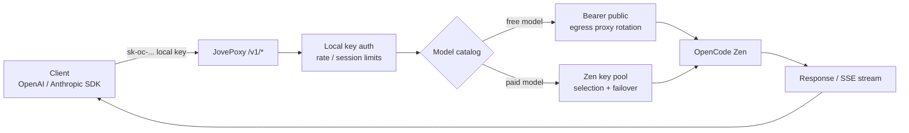
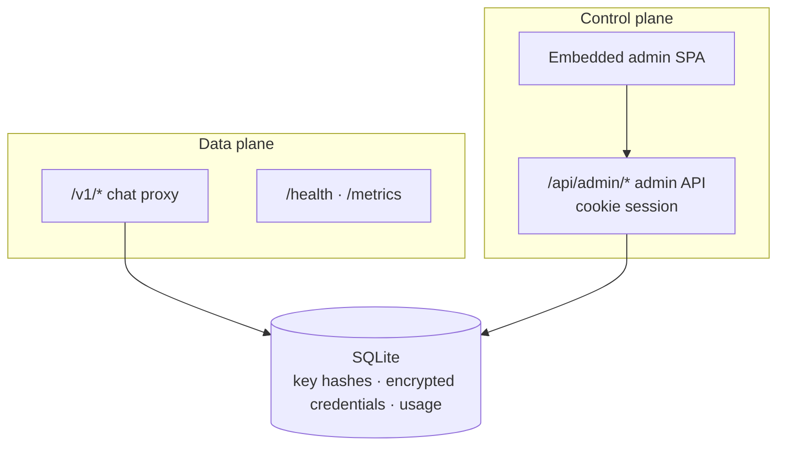

<p align="center">
  
</p>

<h1 align="center">JovePoxy</h1>

<p align="center">A single-process gateway that turns OpenCode Zen free models and a paid key pool into OpenAI / Anthropic compatible APIs, with an embedded Neo-Brutalist admin console</p>

<p align="center">
  <a href="https://github.com/jiujiu532/JovePoxy"></a>
  <a href="https://github.com/jiujiu532/JovePoxy/releases"></a>
  <a href="https://github.com/jiujiu532/JovePoxy/pkgs/container/jovepoxy"></a>
  <a href="https://go.dev/"></a>
  <a href="https://react.dev/"></a>
</p>

<p align="center">
  <a href="README.md">简体中文</a> ·
  <a href="README.en.md">English</a> ·
  <a href="https://github.com/jiujiu532/JovePoxy/releases">Releases</a> ·
  <a href="#quick-start">Quick Start</a> ·
  <a href="#configuration">Configuration</a>
</p>

---

JovePoxy is a single-binary gateway. It exposes OpenAI `/v1/chat/completions` and Anthropic `/v1/messages` compatible endpoints, and routes requests either to OpenCode Zen free models (`Bearer public`) or to a pool of paid Zen API keys with failover. The full admin SPA is embedded on the same listener. All state lives in a single SQLite file; no local OpenCode process is required.

## Features

- **Dual protocol**: OpenAI Chat Completions and Anthropic Messages (including SSE streaming) behind one endpoint.
- **Free / paid auto-routing**: the model catalog classifies free models to the public channel and paid models to the Zen key pool with automatic failover.
- **Local API keys**: issue `sk-oc-...` keys for clients with optional RPM / daily limits and concurrent-session caps; only SHA-256 hashes are stored.
- **Egress proxy pool**: when the free channel is rate-limited (429/5xx), requests retry through rotating egress proxies. Key = identity, proxy = egress IP; the two are independent.
- **Quota & usage monitoring**: scrapes OpenCode / Ollama account quotas (cookies are control-plane only and never enter the chat path); usage is aggregated per model.
- **Neo-Brutalist admin console**: overview dashboards (request trend / token bars / status distribution), model catalog, key pool, accounts, quotas, local keys, proxies, logs, settings; dark mode included.
- **Safe defaults**: Zen keys / cookies / proxy URLs are stored AES-GCM encrypted; request logs never contain prompt or response bodies.
- **Version check**: the console compares the running version against this repository's GitHub Releases.

## Request flow

<details>
<summary><strong>Chat request routing</strong></summary>



</details>

<details>
<summary><strong>Control plane vs data plane</strong></summary>



</details>

## Quick Start

### Docker (recommended)

```bash
docker run -d --name jovepoxy \
  -p 6446:6446 \
  -e ADMIN_PASSWORD=your-password \
  -e ADMIN_SECRET=please-use-a-32-plus-char-secret \
  -v jovepoxy-data:/data \
  ghcr.io/jiujiu532/jovepoxy:latest
```

Open `http://127.0.0.1:6446/`, sign in with `ADMIN_PASSWORD`, create a local key, and use it as an OpenAI / Anthropic API key.

### docker-compose

```yaml
services:
  jovepoxy:
    image: ghcr.io/jiujiu532/jovepoxy:latest
    ports:
      - "6446:6446"
    environment:
      ADMIN_PASSWORD: your-password
      ADMIN_SECRET: please-use-a-32-plus-char-secret
    volumes:
      - jovepoxy-data:/data
volumes:
  jovepoxy-data:
```

### Build from source

```bash
# frontend
cd web && pnpm install --frozen-lockfile && pnpm build && cd ..

# embed and compile (on Windows: make embed-web-win)
mkdir -p internal/webui/dist && cp -R web/dist/. internal/webui/dist/
go build -o bin/jovepoxy ./cmd/server

ADMIN_PASSWORD=... ADMIN_SECRET=... DATA_DIR=./data LISTEN=127.0.0.1:6446 ./bin/jovepoxy
```

## Client examples

```bash
# OpenAI compatible
curl http://127.0.0.1:6446/v1/chat/completions \
  -H "Authorization: Bearer sk-oc-..." \
  -H "Content-Type: application/json" \
  -d '{"model":"big-pickle","messages":[{"role":"user","content":"hello"}]}'

# Anthropic compatible
curl http://127.0.0.1:6446/v1/messages \
  -H "x-api-key: sk-oc-..." \
  -H "anthropic-version: 2023-06-01" \
  -H "Content-Type: application/json" \
  -d '{"model":"claude-sonnet-4-5","max_tokens":256,"messages":[{"role":"user","content":"hello"}]}'
```

## Configuration

| Env var | Required | Default | Description |
|---------|----------|---------|-------------|
| `ADMIN_PASSWORD` | yes | - | Admin console password |
| `ADMIN_SECRET` | yes | - | 32+ chars; encrypts Zen keys / cookies / proxy URLs |
| `LISTEN` | no | `127.0.0.1:6446` | Listen address (`0.0.0.0:6446` in the container) |
| `DATA_DIR` | no | `./data` | SQLite data directory |
| `ZEN_BASE` | no | official endpoint | OpenCode Zen upstream base URL |
| `VERSION_REPO` | no | `jiujiu532/JovePoxy` | GitHub repo used for release version checks |
| `COOKIE_SECURE` | no | `true` | Secure flag on the admin cookie (set `false` for plain HTTP) |
| `SHOW_ALL_MODELS` | no | `false` | Show all upstream models in the catalog |

## Credential model

| Credential | Purpose | Enters chat path |
|------------|---------|:---:|
| Local key `sk-oc-...` | Client → gateway auth | yes |
| `Bearer public` | Zen free models outbound | yes |
| Zen API key pool | Zen paid models outbound | yes |
| OpenCode / Ollama cookies | Quota / usage scraping | **no** |
| `ADMIN_PASSWORD` | Admin console login | no |

## Tech stack

Go 1.25 · SQLite (modernc, CGO-free) · React 19 · Vite 7 · Tailwind CSS 4 · Phosphor Icons · Vitest

## Development

```bash
make test          # Go tests
make vet           # go vet
cd web && pnpm dev # frontend dev server (proxies to :6446)
cd web && pnpm test && pnpm typecheck
```

CI builds multi-arch (amd64 / arm64) images to GHCR on pushes to `main` and `v*` tags; documentation-only changes do not trigger builds.

## License

No license specified yet. Mind the OpenCode Zen terms of service when using this gateway.
