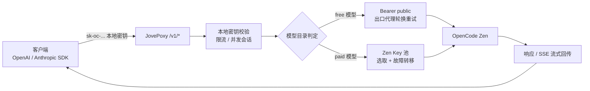
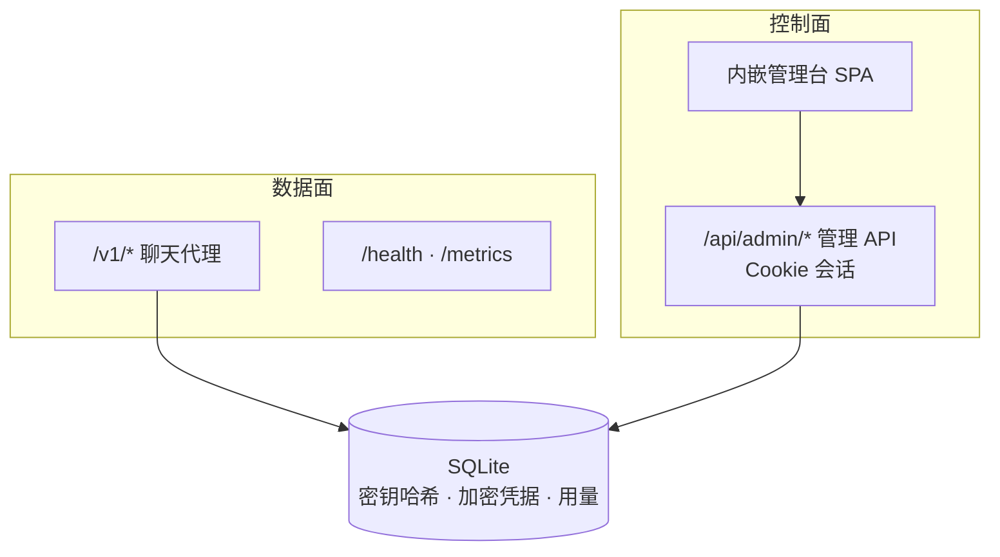

<p align="center">
  
</p>

<h1 align="center">JovePoxy</h1>

<p align="center">把 OpenCode Zen 免费模型与付费 Key 池变成 OpenAI / Anthropic 兼容 API 的单进程网关，内嵌 Neo-Brutalist 管理台</p>

<p align="center">
  <a href="https://github.com/jiujiu532/JovePoxy"></a>
  <a href="https://github.com/jiujiu532/JovePoxy/releases"></a>
  <a href="https://github.com/jiujiu532/JovePoxy/pkgs/container/jovepoxy"></a>
  <a href="https://go.dev/"></a>
  <a href="https://react.dev/"></a>
</p>

<p align="center">
  <a href="README.md">简体中文</a> ·
  <a href="README.en.md">English</a> ·
  <a href="https://github.com/jiujiu532/JovePoxy/releases">版本发布</a> ·
  <a href="#快速开始">快速开始</a> ·
  <a href="#配置">配置</a>
</p>

---

JovePoxy 是一个单二进制网关：对外提供 OpenAI `/v1/chat/completions` 与 Anthropic `/v1/messages` 兼容接口，对内把请求路由到 OpenCode Zen 的免费模型（`Bearer public`）或付费 Zen Key 池；同一监听端口内嵌完整管理台 SPA。数据落在单文件 SQLite，无需本地 OpenCode 进程。

## 核心功能

- **双协议兼容**：OpenAI Chat Completions 与 Anthropic Messages（含 SSE 流式）一套入口全支持。
- **免费 / 付费自动分流**：模型目录自动识别 free 模型走公共通道，付费模型走 Zen Key 池并自动故障转移。
- **本地密钥体系**：给客户端签发 `sk-oc-...` 本地密钥，支持 RPM / 日限额与并发会话限制；库内只存 SHA-256。
- **出口代理池**：free 通道被限流（429/5xx）时自动轮换出口代理重试；Key 是身份，代理是出口 IP，二者独立。
- **额度与用量监控**：抓取 OpenCode / Ollama 账号额度（cookie 仅用于控制面抓取，绝不进聊天链路），用量按模型聚合。
- **Neo-Brutalist 管理台**：概览可视化（趋势 / token / 状态分布）、模型目录、Key 池、账号、额度、本地密钥、代理、日志、设置；支持暗色模式。
- **安全默认**：Zen Key / Cookie / 代理地址 AES-GCM 加密存储；请求日志不落 prompt / response 正文。
- **版本自检**：管理台内置版本检查，默认对本仓库 Releases 比对新版本。

## 请求流程

<details>
<summary><strong>聊天请求分流</strong></summary>



</details>

<details>
<summary><strong>控制面与数据面隔离</strong></summary>



</details>

## 快速开始

### Docker（推荐）

```bash
docker run -d --name jovepoxy \
  -p 6446:6446 \
  -e ADMIN_PASSWORD=your-password \
  -e ADMIN_SECRET=please-use-a-32-plus-char-secret \
  -v jovepoxy-data:/data \
  ghcr.io/jiujiu532/jovepoxy:latest
```

打开 `http://127.0.0.1:6446/`，用 `ADMIN_PASSWORD` 登录管理台，创建本地密钥后即可把它当作 OpenAI / Anthropic API Key 使用。

### docker-compose

```yaml
services:
  jovepoxy:
    image: ghcr.io/jiujiu532/jovepoxy:latest
    ports:
      - "6446:6446"
    environment:
      ADMIN_PASSWORD: your-password
      ADMIN_SECRET: please-use-a-32-plus-char-secret
    volumes:
      - jovepoxy-data:/data
volumes:
  jovepoxy-data:
```

### 源码构建

```bash
# 前端
cd web && pnpm install --frozen-lockfile && pnpm build && cd ..

# 嵌入并编译（Windows 可用 make embed-web-win）
mkdir -p internal/webui/dist && cp -R web/dist/. internal/webui/dist/
go build -o bin/jovepoxy ./cmd/server

ADMIN_PASSWORD=... ADMIN_SECRET=... DATA_DIR=./data LISTEN=127.0.0.1:6446 ./bin/jovepoxy
```

## 客户端接入示例

```bash
# OpenAI 兼容
curl http://127.0.0.1:6446/v1/chat/completions \
  -H "Authorization: Bearer sk-oc-..." \
  -H "Content-Type: application/json" \
  -d '{"model":"big-pickle","messages":[{"role":"user","content":"hello"}]}'

# Anthropic 兼容
curl http://127.0.0.1:6446/v1/messages \
  -H "x-api-key: sk-oc-..." \
  -H "anthropic-version: 2023-06-01" \
  -H "Content-Type: application/json" \
  -d '{"model":"claude-sonnet-4-5","max_tokens":256,"messages":[{"role":"user","content":"hello"}]}'
```

## 配置

| 环境变量 | 必填 | 默认 | 说明 |
|----------|------|------|------|
| `ADMIN_PASSWORD` | 是 | - | 管理台登录密码 |
| `ADMIN_SECRET` | 是 | - | ≥32 字符，用于加密 Zen Key / Cookie / 代理地址 |
| `LISTEN` | 否 | `127.0.0.1:6446` | 监听地址（容器内默认 `0.0.0.0:6446`） |
| `DATA_DIR` | 否 | `./data` | SQLite 数据目录 |
| `ZEN_BASE` | 否 | 官方地址 | OpenCode Zen 上游地址 |
| `VERSION_REPO` | 否 | `jiujiu532/JovePoxy` | 版本检查对比的 GitHub 仓库 |
| `COOKIE_SECURE` | 否 | `true` | 管理台 Cookie Secure 标记（HTTP 环境设为 `false`） |
| `SHOW_ALL_MODELS` | 否 | `false` | 模型目录是否展示全部上游模型 |

## 凭据模型

| 凭据 | 用途 | 进聊天链路 |
|------|------|:---:|
| 本地密钥 `sk-oc-...` | 客户端 → 网关认证 | 是 |
| `Bearer public` | Zen 免费模型出站 | 是 |
| Zen API Key 池 | Zen 付费模型出站 | 是 |
| OpenCode / Ollama Cookie | 额度、用量抓取 | **否** |
| `ADMIN_PASSWORD` | 管理台登录 | 否 |

## 技术栈

Go 1.25 · SQLite（modernc，无 CGO）· React 19 · Vite 7 · Tailwind CSS 4 · Phosphor Icons · Vitest

## 开发

```bash
make test          # Go 测试
make vet           # go vet
cd web && pnpm dev # 前端开发（代理到 :6446）
cd web && pnpm test && pnpm typecheck
```

CI 在推送到 `main` 或打 `v*` 标签时自动构建多架构（amd64 / arm64）镜像发布到 GHCR；纯文档改动不触发构建。

## 许可

暂未指定许可证。使用前请注意 OpenCode Zen 的服务条款。
