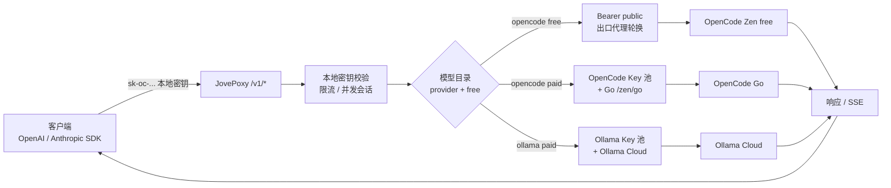
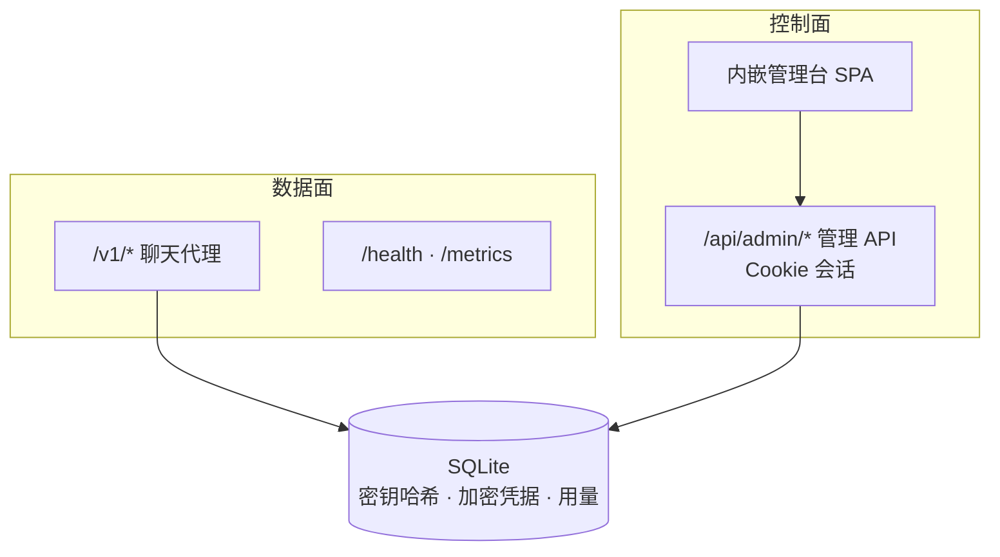

<p align="center">
  
</p>

<h1 align="center">JovePoxy</h1>

<p align="center">
  单进程网关：把 <strong>OpenCode Zen</strong> 免费模型 + 付费 Key 池，以及 <strong>Ollama Cloud</strong> Key 池，统一成 OpenAI / Anthropic 兼容 API，并内嵌 Neo-Brutalist 管理台
</p>

<p align="center">
  <a href="https://github.com/jiujiu532/JovePoxy"></a>
  <a href="https://github.com/jiujiu532/JovePoxy/releases"></a>
  <a href="https://github.com/jiujiu532/JovePoxy/pkgs/container/jovepoxy"></a>
  <a href="https://go.dev/"></a>
  <a href="https://react.dev/"></a>
  
  <a href="LICENSE"></a>
</p>

<p align="center">
  <a href="README.md">简体中文</a> ·
  <a href="README.en.md">English</a> ·
  <a href="https://github.com/jiujiu532/JovePoxy/releases">版本发布</a> ·
  <a href="#快速开始">快速开始</a> ·
  <a href="#配置">配置</a>
</p>

---

## 这是什么

JovePoxy（`module jovepoxy`）是一个**单二进制**网关：

| 能力 | 说明 |
|------|------|
| 数据面 | `POST /v1/chat/completions`、`/v1/responses`、`/v1/messages`（含 SSE） |
| 模型目录 | **Zen free**（public）+ **OpenCode Go**（有健康 OpenCode 池密钥时）+ **Ollama Cloud**（有健康 Ollama 池密钥时） |
| 上游 | Free → Zen `Bearer public`；Paid OpenCode → **Go** `/zen/go` + Key 池；Paid Ollama → Ollama Cloud + Key 池 |
| 控制面 | `/api/admin/*` Cookie 会话 + 同端口内嵌管理台 SPA |
| 存储 | 单文件 SQLite；**不需要**本机 OpenCode / 本机 Ollama 进程 |

版本：`internal/version.Current`（默认 **1.5.0**）；`--version` 与 `/health` 输出 `jovepoxy 1.5.0`。

## 核心功能

- **三端点兼容**：OpenAI Chat Completions、OpenAI Responses、Anthropic Messages，一套本地密钥即可调用。
- **套餐对齐目录**：public Zen 只保留 free；有健康 `provider=opencode` 密钥时合并 **Go** `/zen/go/v1/models`；有健康 `provider=ollama` 密钥时合并 Ollama Cloud `/v1/models`。不暴露 public 上的 Claude/Gemini 等 Go 套餐不可用模型。
- **按 provider 路由**：OpenCode free → `/zen/v1` + `Bearer public`；OpenCode paid → `/zen/go/v1` + Key 池；Ollama paid → Ollama Cloud + Key 池。
- **本地密钥 `sk-oc-...`**：客户端只认网关密钥；支持 RPM / 日限额与并发会话；校验用 SHA-256，完整密钥以 `ADMIN_SECRET` AES-GCM 加密落库，管理台可复制完整密钥（升级前仅哈希的旧密钥无法还原，需重建）。
- **密钥池 + 出口代理池**：Key = 身份，Proxy = 出口 IP，彼此独立；free 遇 429/5xx 可轮换出口重试；paid 支持 spread / sticky 与故障转移。
- **额度与用量**：OpenCode / Ollama **账号 Cookie 仅用于控制面刮取**，绝不进入聊天链路。
- **Neo-Brutalist 管理台**：概览、模型目录（来源筛选）、密钥池、账号、额度、本地密钥、代理、日志、设置；深色模式。
- **安全默认**：本地密钥完整串、Zen/Ollama Key、Cookie、代理 URL 经 `ADMIN_SECRET` AES-GCM 加密；列表接口不返回完整密钥；请求日志不落 prompt/response 正文。

## 请求流程

<details>
<summary><strong>聊天请求分流</strong></summary>



</details>

<details>
<summary><strong>控制面与数据面</strong></summary>



</details>

## 快速开始

### Docker（推荐）

```bash
docker run -d --name jovepoxy \
  -p 6446:6446 \
  -e ADMIN_PASSWORD=your-password \
  -e ADMIN_SECRET=please-use-a-32-plus-char-secret \
  -v jovepoxy-data:/data \
  ghcr.io/jiujiu532/jovepoxy:1.5.0
# 或 :latest
```

打开 `http://127.0.0.1:6446/`，用 `ADMIN_PASSWORD` 登录 → 创建本地密钥 → 在密钥池按需添加 OpenCode / Ollama API Key。

### docker-compose

```yaml
services:
  jovepoxy:
    image: ghcr.io/jiujiu532/jovepoxy:1.5.0
    ports:
      - "6446:6446"
    environment:
      ADMIN_PASSWORD: your-password
      ADMIN_SECRET: please-use-a-32-plus-char-secret
      DATA_DIR: /data
      LISTEN: 0.0.0.0:6446
    volumes:
      - jovepoxy-data:/data
volumes:
  jovepoxy-data:
```

### 源码构建

```bash
# 前端
cd web && pnpm install --frozen-lockfile && pnpm build && cd ..

# 嵌入并编译（Windows 可用 make embed-web-win）
mkdir -p internal/webui/dist && cp -R web/dist/. internal/webui/dist/
go build -ldflags "-X jovepoxy/internal/version.Current=1.5.0" -o bin/jovepoxy ./cmd/server

# 运行（ADMIN_SECRET ≥ 32 字符）
export ADMIN_PASSWORD=...
export ADMIN_SECRET=...
export DATA_DIR=./data
export LISTEN=127.0.0.1:6446
./bin/jovepoxy
```

Windows 也可使用 `start.bat` / `stop.bat`（默认监听 `127.0.0.1:6446`）。

## 客户端接入

```bash
# OpenAI Chat Completions
curl http://127.0.0.1:6446/v1/chat/completions \
  -H "Authorization: Bearer sk-oc-..." \
  -H "Content-Type: application/json" \
  -d '{"model":"big-pickle","messages":[{"role":"user","content":"hello"}]}'

# OpenAI Responses
curl http://127.0.0.1:6446/v1/responses \
  -H "Authorization: Bearer sk-oc-..." \
  -H "Content-Type: application/json" \
  -d '{"model":"big-pickle","input":"hello"}'

# Anthropic Messages
curl http://127.0.0.1:6446/v1/messages \
  -H "x-api-key: sk-oc-..." \
  -H "anthropic-version: 2023-06-01" \
  -H "Content-Type: application/json" \
  -d '{"model":"claude-sonnet-4-5","max_tokens":256,"messages":[{"role":"user","content":"hello"}]}'
```

公开 `GET /v1/models`：默认仅 free；`SHOW_ALL_MODELS=true` 时包含目录中的 paid（Go + Ollama，不含 public 不可用模型）。`owned_by` 为 `zen`（OpenCode）或 `ollama`。

## 配置

| 环境变量 | 必填 | 默认 | 说明 |
|----------|------|------|------|
| `ADMIN_PASSWORD` | 是 | - | 管理台登录密码 |
| `ADMIN_SECRET` | 是 | - | ≥32 字符；加密池密钥 / Cookie / 代理 URL |
| `LISTEN` | 否 | `0.0.0.0:6446` | 监听地址；本机开发可设 `127.0.0.1:6446` |
| `DATA_DIR` | 否 | `./data` | SQLite 目录（容器内常用 `/data`） |
| `ZEN_BASE` | 否 | `https://opencode.ai/zen/v1` | OpenCode Zen **free** 上游（`Bearer public`） |
| `ZEN_GO_BASE` | 否 | `https://opencode.ai/zen/go` | OpenCode **Go** 套餐目录与付费聊天（自动补 `/v1`） |
| `OLLAMA_BASE` | 否 | `https://ollama.com` | Ollama Cloud 根；进程会规范为 `…/v1` 再请求 |
| `MODEL_CACHE_TTL` | 否 | `5m` | 模型目录缓存 TTL |
| `UPSTREAM_TIMEOUT` | 否 | `120s` | 上游超时 |
| `SHOW_ALL_MODELS` | 否 | `false` | 为 `true` 时 `/v1/models` 展示全部模型 |
| `COOKIE_SECURE` | 否 | `false` | 管理台 Cookie 的 Secure 标记；HTTPS 部署建议 `true` |
| `VERSION_REPO` | 否 | `jiujiu532/JovePoxy` | 管理台版本检查对照的 GitHub 仓库 |
| `HTTP_PROXY` / `HTTPS_PROXY` | 否 | - | 进程级上游代理（与管理台「出口代理池」不同） |
| `ZEN_LOAD_POLICY` | 否 | `spread` | 付费池策略：`spread` \| `sticky`（运行时仍可在设置中改） |
| `ZEN_MAX_ATTEMPTS` | 否 | `2` | 付费故障转移尝试次数（2–4） |

## 凭据模型（切勿混用）

| 凭据 | 用途 | 进聊天链路 |
|------|------|:----------:|
| 本地密钥 `sk-oc-...` | 客户端 → 网关 | 是 |
| `Bearer public` | Zen free 出站 | 是 |
| 密钥池 `provider=opencode` | Zen paid 出站 | 是 |
| 密钥池 `provider=ollama` | Ollama Cloud 出站 + 拉 Ollama 模型目录 | 是 |
| OpenCode / Ollama **账号 Cookie** | 额度 / 用量刮取 | **否** |
| `ADMIN_PASSWORD` | 管理台登录 | 否 |

> **说明**：管理台里的「Ollama 账号 + Cookie」**不能**用来拉模型目录或聊天。要在 Models 页看到 Ollama 模型，请在**密钥池**添加启用中的 Ollama **API Key**。

## 技术栈

Go 1.25 · SQLite（modernc，无 CGO）· React 19 · Vite 7 · Tailwind CSS 4 · Phosphor Icons · Vitest · pnpm

## 开发

```bash
make test              # go test -shuffle=on -count=1 ./...
make vet
make build             # go build -o bin/jovepoxy(.exe) ./cmd/server
make embed-web-win     # 构建 web 并拷入 internal/webui/dist（Windows）
make smoke             # 本地 health / login / 建 key（不连真 Zen）

cd web
pnpm install --frozen-lockfile
pnpm dev               # :5173，代理 /api /v1 /health → :6446
pnpm test && pnpm typecheck
```

推送到 `main`（非纯文档）或打 `v*` 标签时，CI 构建并推送 **linux/amd64 + arm64** 镜像到 GHCR；镜像构建参数 `VERSION` 写入 `version.Current`。

## 许可

本项目采用 [MIT License](LICENSE)。

使用本网关访问 OpenCode Zen / Ollama Cloud 时，仍须遵守对应上游服务条款。
